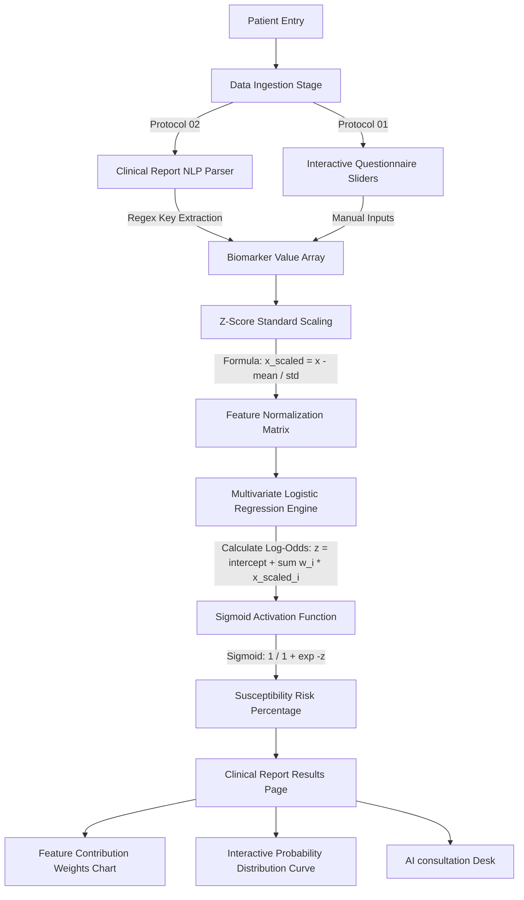
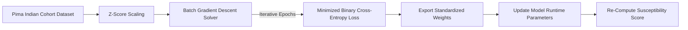
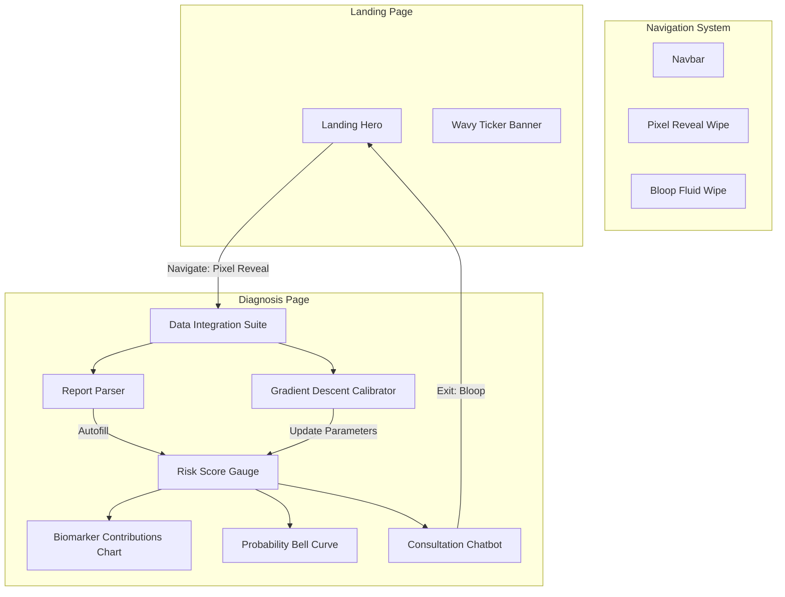

# GLYCOS AI — Clinical Metabolic Susceptibility Engine

GLYCOS AI is a client-side metabolic intelligence platform designed to compute susceptibility indexes using standardized multivariate logistic regression. The engine operates entirely in the browser, featuring clinical text parsing, an in-browser Gradient Descent solver, and interactive visualization charts.

---

## 1. Core Architecture Pipeline

The diagram below outlines the runtime workflow, data extraction methods, normalization techniques, and risk estimation calculations.

---

## 2. In-Browser ML Calibration Dashboard

Users can calibrate predictions locally by training custom coefficients directly on the historical Pima Indians Cohort.

---

## 3. High-Fidelity Components & Layout Map

---

## 4. Technical Engine Specifications

### A. Multivariate Logistic Regression Solver
The core diagnostic score is calculated using standard z-score standardized parameters:

$$\mathbf{z} = \beta_0 + \sum_{i=1}^{n} \beta_i \left( \frac{x_i - \mu_i}{\sigma_i} \right)$$

$$\text{Probability} = \frac{1}{1 + e^{-\mathbf{z}}}$$

#### Default Standardized Calibration Coefficients:
*   **Intercept ($\beta_0$):** `-0.7749`
*   **Pregnancies:** `0.4152`
*   **Glucose:** `1.1253`
*   **Blood Pressure:** `-0.2575`
*   **Skin Thickness:** `0.0096`
*   **Insulin:** `-0.1383`
*   **BMI:** `0.7068`
*   **Diabetes Pedigree Score:** `0.3782`
*   **Age:** `0.1752`

### B. NLP Clinical Parser
Uses customized regex mappings to parse key values out of unstructured text reports, matching standard clinical names:
*   **Pregnancies:** `/(?:pregnancies|pregnancy\s*count):\s*(\d+)/i`
*   **Glucose:** `/(?:glucose|plasma\s*glucose|concentration):\s*(\d+)/i`
*   **Blood Pressure:** `/(?:blood\s*pressure|diastolic):\s*(\d+)/i`
*   **Skin Thickness:** `/(?:skin\s*thickness|fold):\s*(\d+)/i`
*   **Insulin:** `/(?:insulin|serum\s*insulin):\s*(\d+)/i`
*   **BMI:** `/(?:bmi|body\s*mass\s*index):\s*(\d+\.?\d*)/i`
*   **Pedigree Score:** `/(?:pedigree|pedigree\s*function):\s*(\d+\.?\d*)/i`
*   **Age:** `/(?:age|years\s*old):\s*(\d+)/i`

---

## 5. Apache License 2.0

Licensed under the Apache License, Version 2.0 (the "License"); you may not use this file except in compliance with the License. You may obtain a copy of the License at:

http://www.apache.org/licenses/LICENSE-2.0

Unless required by applicable law or agreed to in writing, software distributed under the License is distributed on an "AS IS" BASIS, WITHOUT WARRANTIES OR CONDITIONS OF ANY KIND, either express or implied. See the License for the specific language governing permissions and limitations under the License.
